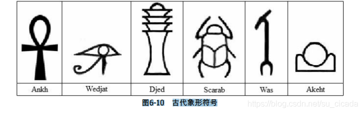
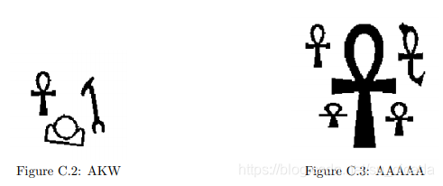

>本题的目的是识别3000年前古埃及用到的6种象形文字，如图6-10所示。

图6-10 古代象形符号
每组数据包含一个H行W列的字符矩阵（H≤200，W≤50），每个字符为4个相邻像素点的
十六进制（例如，10011100对应的字符就是9c）。转化为二进制后1表示黑点，0表示白点。
输入满足：
不会出现上述6种符号之外的其他符号。
输入至少包含一个符号，且每个黑像素都属于一个符号。
每个符号都是一个四连块，并且不同符号不会相互接触，也不会相互包含。
如果两个黑像素有公共顶点，则它们一定有一个相同的相邻黑像素（有公共边）。
符号的形状一定和表6-9中的图形拓扑等价（可以随意拉伸但不能拉断）。
要求按照字典序输出所有符号。例如，图6-11中的输出应为AKW。

**样例参见 [https://www.udebug.com/UVa/1103](https://www.udebug.com/UVa/1103)**

[本家连接](https://onlinejudge.org/index.php?option=com_onlinejudge&Itemid=8&category=838&page=show_problem&problem=3544)

--------------------------------
分为以下几个步骤：
关键在于辨识每个图形中的空白四连块的数量。就是[UVA 572 - Oil Deposits (油田) By SuCicada](https://blog.csdn.net/su_cicada/article/details/107775496)的升级版。
好就好在每个图形的白块数量不同，然而如何区分图形内的空白和图形外的空白是个问题。所以我在一开始就把外面的空白都涂黑了。
然后遍历，遍历到文字就将其当作油田求内部连通白块。
（最后的排序是手动实现的插入（:P）
/* 
    1. 16进制 转 2进制
    2. 从最外围开始融化 白纸
    3. 遍历到文字黑色边缘, 
    4. 向内遍历找"油田", 即4连块
    5. 计算每个文字的4连块数量
    6. 结束文字们, 根据4连块数量映射文字, 排序
    
*/

```cpp
#include<iostream>
#include<string>
#include<algorithm>
#include<cstring>
using namespace std;
/* 
    1. 16进制 转 2进制
    2. 从最外围开始融化 白纸
    3. 遍历到文字黑色边缘, 
    4. 向内遍历找"油田", 即4连块
    5. 计算每个文字的4连块数量
    6. 结束文字们, 根据4连块数量映射文字, 排序
    
*/


char paper[209][209];
int h,w;    
char res[2222];
int resIndex = 0;
/* 文字映射, 下标即文字的空白块数量 */
char wordMap[8] = {'W','A','K','J','S','D'};
void hex2bin(char c,char res[]){

    int n=0;
    if(c<='9' && c >='0'){
        n = c+'0';
    }else if(c>='a' && c<='f'){
        n = c-'a' + 10;
    }

    // int res[4] = {0,0,0,0};
    int index = 3;
    while(index>=0 && n){
        res[index--] = n%2 + '0';
        n /= 2;
    }
}
void show(){
    for(int i=0;i<h;i++){
        for(int j=0;j<w;j++){
            cout<<paper[i][j];
        }
        cout<<endl;
    }
}

/* 文字外围空空 */
void bargin(int x,int y){
    char look='-';
    if(x<0 || x>=h || y<0 || y >=w || paper[x][y]!='0'){
        return;
    }
    paper[x][y]=look;
    for(int i=-1;i<=1;i++){
        for(int j=-1;j<=1;j++){
            if((!i || !j) && (i || j)){
                bargin(x+i,y+j);
            }
        }
    }
}
void block(int x,int y);
/* 黑色文字 */
int black(int x,int y,int sum){
    char need='1';
    char look='x';
    if(x<0 || x>=h || y<0 || y >=w){
        return sum;
    }
    if(paper[x][y] == '0'){
    // cout<<x<<" "<<y<<" "<<paper[x][y]<<endl;
        sum ++;
        block(x,y);
        // show();
    }else if(paper[x][y] == need){
        paper[x][y]=look;
        for(int i=-1;i<=1;i++){
            for(int j=-1;j<=1;j++){
                if((!i || !j) && (i || j)){
                    sum = black(x+i,y+j,sum);
                }
            }
        }
    }
    return sum;
}

/* 文字中间空空 */
void block(int x,int y){
    char need = '0';
    char bloc = '+';
    if(x<0 || x>=h || y<0 || y >=w || paper[x][y]!=need){
        return;
    }
    paper[x][y]=bloc;
    block(x+1,y);
    block(x-1,y);
    block(x,y+1);
    block(x,y-1);
}
void insert(char ch){
    int sureIndex = resIndex;
    int beforeIndex = sureIndex - 1;
    while(beforeIndex>=0 && res[beforeIndex] > ch){
        res[sureIndex] = res[beforeIndex];
        sureIndex --;
        beforeIndex --;
    }
    resIndex ++;
    res[sureIndex] = ch;
}
int main(){
    int a,b;
    int T=1;
    while(1){
        h=w=0;
        resIndex=0;
        memset(paper,0,sizeof(paper));
        memset(res,0,sizeof(res));


        cin>>a>>b;
        if(!a && !b){
            break;
        }
        h=a,w=b*4;
        /*  init */
        for(int i=0;i<a;i++){
            for(int j=0;j<b;j++){
                char c;
                cin>>c;
                char num[4] ={'0','0','0','0'}; 
                hex2bin(c,num);
                for(int k=0;k<4;k++){
                    paper[i][j*4+k] = num[k];
                }

            }
        }


        /* 减去背景空白部分 */
        for(int i=0;i<h;i++){
            bargin(i,0);
            bargin(i,w-1);
        }
        for(int j=0;j<w;j++){
            bargin(0,j);
            bargin(h-1,j);
        }

        // show();
        for(int i=0;i<h;i++){
            for(int j=0;j<w;j++){
                if(paper[i][j] == '1'){
                    int sum=0;
                    sum = black(i,j,0);
                    insert(wordMap[sum]);
                    // cout<<sum<<endl;
                }
            }
        }

        cout<<"Case "<<T++<<": ";
        for(int i=0;i<resIndex;i++){
            cout<<res[i];
        }
        cout<<endl;
    }

    return 0;
}

// AC at 2020/08/01
```
