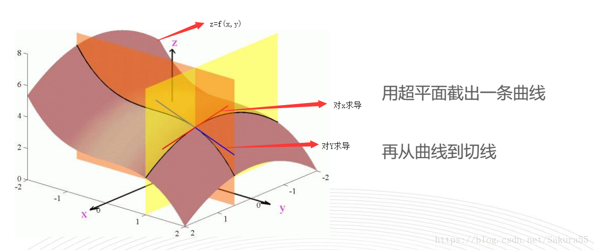
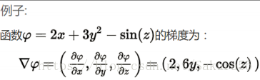
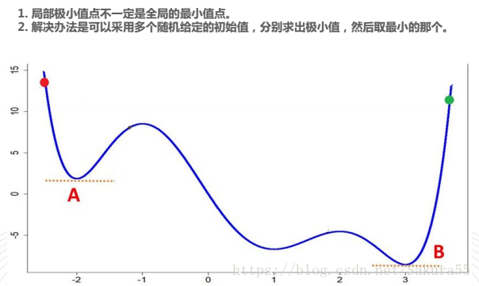

# (238条消息) 数学必知必会----导数、梯度与积分_sakura小樱的博客-CSDN博客_梯度求积分

# 数学必知必会----导数、梯度与积分


[sakura小樱](https://blog.csdn.net/Sakura55 "sakura小樱")  于 2018-06-12 19:18:22 发布  3204  收藏 6

文章标签： [导数](https://so.csdn.net/so/search/s.do?q=%E5%AF%BC%E6%95%B0&t=blog&o=vip&s=&l=&f=&viparticle=) [数学](https://so.csdn.net/so/search/s.do?q=%E6%95%B0%E5%AD%A6&t=blog&o=vip&s=&l=&f=&viparticle=) [微积分](https://so.csdn.net/so/search/s.do?q=%E5%BE%AE%E7%A7%AF%E5%88%86&t=blog&o=vip&s=&l=&f=&viparticle=)

版权

*   [一、导数](#%E4%B8%80%E5%AF%BC%E6%95%B0)
    *   [1.1常用的倒数](#11%E5%B8%B8%E7%94%A8%E7%9A%84%E5%80%92%E6%95%B0)
    *   [1.2复合函数求导](#12%E5%A4%8D%E5%90%88%E5%87%BD%E6%95%B0%E6%B1%82%E5%AF%BC)
        *   [1.2.1链式法则](#121%E9%93%BE%E5%BC%8F%E6%B3%95%E5%88%99)
        *   [1.2.2多元函数求导：偏导数（偏微分）](#122%E5%A4%9A%E5%85%83%E5%87%BD%E6%95%B0%E6%B1%82%E5%AF%BC%E5%81%8F%E5%AF%BC%E6%95%B0%E5%81%8F%E5%BE%AE%E5%88%86)
*   [二、积分](#%E4%BA%8C%E7%A7%AF%E5%88%86)
    *   [定积分](#%E5%AE%9A%E7%A7%AF%E5%88%86)
    *   [不定积分](#%E4%B8%8D%E5%AE%9A%E7%A7%AF%E5%88%86)
    *   [拓展](#%E6%8B%93%E5%B1%95)
*   [三、均方误差](#%E4%B8%89%E5%9D%87%E6%96%B9%E8%AF%AF%E5%B7%AE)
    *   [3.1导数应用](#31%E5%AF%BC%E6%95%B0%E5%BA%94%E7%94%A8)
    *   [3.2线性回归的应用](#32%E7%BA%BF%E6%80%A7%E5%9B%9E%E5%BD%92%E7%9A%84%E5%BA%94%E7%94%A8)
*   [四、梯度](#%E5%9B%9B%E6%A2%AF%E5%BA%A6)
    *   [4.1导入](#41%E5%AF%BC%E5%85%A5)
    *   [4.2定义：](#42%E5%AE%9A%E4%B9%89)
    *   [4.3事例](#43%E4%BA%8B%E4%BE%8B)
    *   [4.4理解方法](#44%E7%90%86%E8%A7%A3%E6%96%B9%E6%B3%95)
    *   [4.5梯度下降法定义](#45%E6%A2%AF%E5%BA%A6%E4%B8%8B%E9%99%8D%E6%B3%95%E5%AE%9A%E4%B9%89)
    *   [4.6局部极限值](#46%E5%B1%80%E9%83%A8%E6%9E%81%E9%99%90%E5%80%BC)
    *   [4.7下降法求最小值方法](#47%E4%B8%8B%E9%99%8D%E6%B3%95%E6%B1%82%E6%9C%80%E5%B0%8F%E5%80%BC%E6%96%B9%E6%B3%95)
        *   [4.7.1抛小球法—momentum](#471%E6%8A%9B%E5%B0%8F%E7%90%83%E6%B3%95momentum)
        *   [4.7.2Nesterov](#472nesterov)
        *   [4.7.3自适应](#473%E8%87%AA%E9%80%82%E5%BA%94)
        *   [4.7.4AdaDelta以及RMSprop](#474adadelta%E4%BB%A5%E5%8F%8Armsprop)
        *   [4.7.5选择](#475%E9%80%89%E6%8B%A9)

```
from sympy import *
x=Symbol("x")
diff(x**3 + x**2)
#3x**2 + 2**x
```

# 一、导数


> 导数的实质就是曲线切线的斜率

## 1.1常用的倒数

  


## 1.2[复合函数](https://so.csdn.net/so/search?q=%E5%A4%8D%E5%90%88%E5%87%BD%E6%95%B0&spm=1001.2101.3001.7020)求导

### 1.2.1链式法则


### 1.2.2多元函数求导：偏导数（偏微分）



> 链式法则  
> 
> 
> 多元函数求导的法则  
> 

# 二、积分

**积分是微分的逆运算**，即知道了函数的 导函数，反求原函数。在应用上，积分作用不仅如此，它被大量应用于**求和**，通俗的说是求 曲边三角形的面积，这巧妙的求解方法是积分特殊的性质决定的。

[更多推导公式点击这里](https://baike.sogou.com/v360196.htm)

## 定积分


## 不定积分


## 拓展

● [微分的相关知识](http://ishare.iask.sina.com.cn/f/6652047.html)

* * *

# 三、均方误差

## 3.1导数应用


## 3.2线性回归的应用


# 四、梯度

## 4.1导入


## 4.2定义：

> 一元函数在y=f(x)在点x^o的梯度是  
> 
> 
> 二元函数在y=f(x，y)在点(x^o,y^0)的梯度是

## 4.3事例



## 4.4理解方法


## 4.5梯度下降法定义


## 4.6局部极限值



## 4.7下降法求最小值方法

> 定义  
> 

### 4.7.1抛小球法—momentum


### 4.7.2Nesterov


### 4.7.3自适应


### 4.7.4AdaDelta以及RMSprop


### 4.7.5选择


